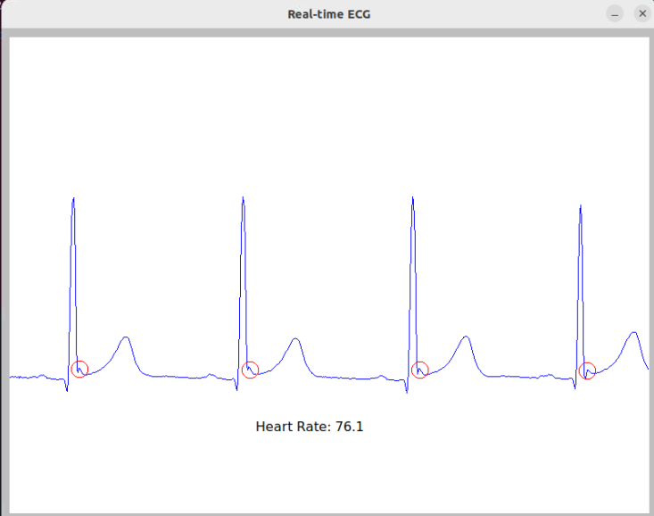
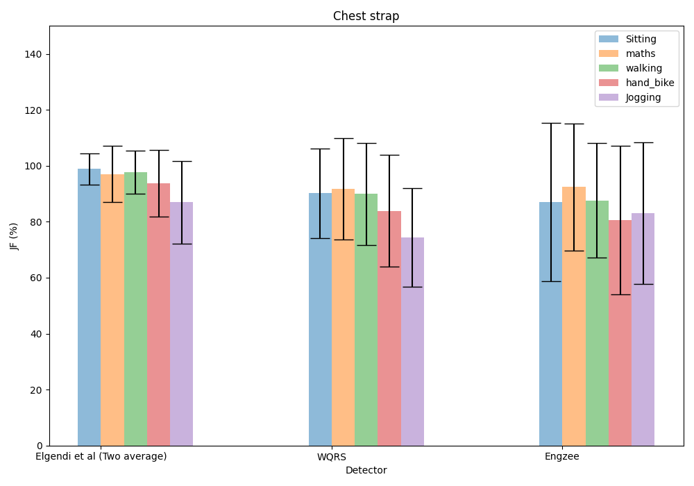
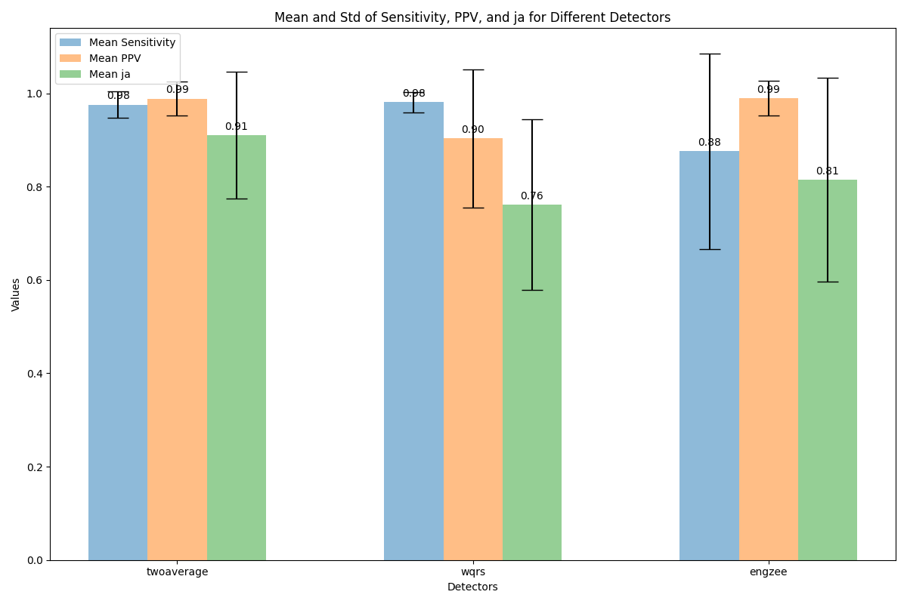

# ecg_detector
C++ implementation of the following ECG r-peak detectors:

**Two-Avergae detector:**
Elgendi, Mohamed & Jonkman, Mirjam & De Boer, Friso. (2010).Frequency Bands Effects on QRS Detection.The 3rd International Conference on Bio-inspired Systems and Signal Processing (BIOSIGNALS2010). 428-431.

**WQRS detector:**
W Zong, GB Moody, D Jiang  A Robust Open-source Algorithm to Detect Onset and Duration of QRS Complexes In: 2003 IEEE

**Engzee detector:**
W. Engelse and C. Zeelenberg, “A single scan algorithm for QRS detection and feature extraction”, IEEE Comp. in Cardiology, vol. 6, pp. 37-42, 1979 with modifications A. Lourenco, H. Silva, P. Leite, R. Lourenco and A. Fred, “Real Time Electrocardiogram Segmentation for Finger Based ECG Biometrics”, BIOSIGNALS 2012, pp. 49-54, 2012.

Based on the Python version of the EngZee detector (https://github.com/berndporr/py-ecg-detectors) initially written by Luis Howell.


Use FLTK library to draw simple realtime ECG figures.


## Build

#### Linux 

Run

```
cmake .
```
which generates the Makefile. Then run:
```
make
```

the output program will be  **output/OnlineEcgDetector** , **output/OfflineEcgDetector**.


#### windows:

Run

```
cmake -G "Visual Studio 16 2019" .
```

which generates the Makefile. Then run:

```
cmake --build . 
```

the output program will be  **output/Debug/OfflineEcgDetector**.


## Usage

#### **Offline Detector**:

use the **OfflineEcgDetector** program

```
./OfflineEcgDetector <sample file> <detector type> <sample frequency>
detector type: 0 for TwoAverage, 1 for Wqrs, 2 for engzee
```

for-example

```
$ output/OfflineEcgDetector ../example_data/ECG.tsv 0 250
QRS detected at index: 112 310 503 698 ...
```

when need to handle lots of file at a time, can use tool:detect_on_test_dataset.
```
output/detect_on_test_dataset $(dataset_dir)
```
the results will be stored same dir with original ECG.tsv


#### **Online Detector** (only test on linux):

currently is just a demo which reads existing ECG dataset to simulate real-world conditions.
needs to make compatible with some real ECG sensors.

```
./OfflineEcgDetector <sample file> <sample frequency>
```



## evaluate performance
caution: in this test case we use the dataset_716 from University Of Glasgow ,if use any other datasets, please modify the evalute scripts to get access to new data.
the evaluate scripts are slightly modified from https://github.com/berndporr/JF-ECG-Benchmark

1. use cpp program to get all detected r-peaks data.

```
output/detect_on_test_dataset $(dataset_dir)
```
2. use python scripts to compare detected r-peaks with annotated r-peaks data.

```
python scripts/evaluate_cpp_detector_results.py $(dataset_dir)
```

3. use python scripts to calculate and show the general JF-score.

```
./scripts/jf_stats_detectors.py
```


If you have the python detector installed then you can compare its the python version

### Test on MIT-BIH Arrhythmia Database



## Todo
improve the robust of engzee detectors.

make program compatible with the Attys Bluetooth biomedical sensor.

# Credit

Bernd Porr

Charles Chen
